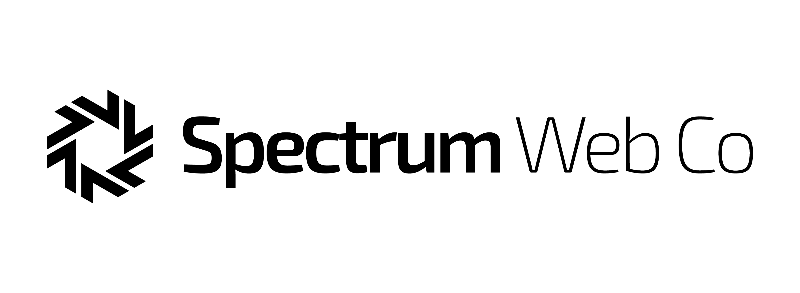
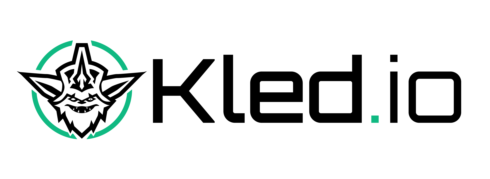

 
<a href="https://www.kled.io">
  <picture width="500">
    <source media="(prefers-color-scheme: dark)" srcset="marketing-assets/kled.io-tranparent-white.png">
    
  </picture>
</a>

### **[Website](https://www.kled.io)** • **[Quickstart](https://www.docs.kled.io/getting-started/install)** • **[Documentation](https://www.docs.kled.io)** • **[Blog](https://www.spectrumwebco.com.au/blog)** • **[𝕏 (Twitter)](https://x.com/spectrumwebco)** • **[Slack](https://slack.spectrumwebco.com.au/)**

 

**Built by [Spectrum Web Co](https://www.spectrumwebco.com.au/) - Powering the future of AI-driven development environments.**

Kled.io is a client-only tool to create reproducible AI-ready developer environments based on a [devcontainer.json](https://containers.dev/) on any backend. Each developer environment runs in a container and is specified through a [devcontainer.json](https://containers.dev/). Through Kled.io providers, these environments can be created on any backend, such as the local computer, a Kubernetes cluster, any reachable remote machine, or in a VM in the cloud.

You can think of Kled.io as the glue that connects your local IDE to a machine where you want to develop. Depending on the requirements of your project, you can either create a workspace locally on the computer, on a beefy cloud machine with many GPUs, or a spare remote computer. Within Kled.io, every workspace is managed the same way, which also makes it easy to switch between workspaces that might be hosted somewhere else.

## Quickstart

Download Kled.io Desktop (join the waitlist for access):
- [MacOS Silicon/ARM](https://www.kled.io/privatebeta/)
- [MacOS Intel/AMD](https://www.kled.io/privatebeta/)
- [Windows](https://www.kled.io/privatebeta/)
- [Linux AppImage](https://www.kled.io/privatebeta/)

Take a look at the [Kled.io Docs](https://www.docs.kled.io/) for more information.

## Why Kled.io?

Kled.io reuses the open [DevContainer standard](https://containers.dev/) (used by GitHub Codespaces and VSCode DevContainers) to create a consistent developer experience no matter what backend you want to use, with additional features for AI-powered development.

Compared to hosted services such as Github Codespaces, JetBrains Spaces, or Google Cloud Workstations, Kled.io has the following advantages:
* **GPU Support**: Kled.io offers full CUDA support for your AI Agent needs, providing flexible GPU resources when and where you need them.
* **MCP Client Integration**: Built-in Model Context Protocol client for seamless AI assistant integration.
* **Apple Silicon Optimization**: Leverage M2 chips for benchmarking and AI model development.
* **Cost savings**: Kled.io is usually around 5-10 times cheaper than existing services with comparable feature sets because it uses bare virtual machines in any cloud and shuts down unused virtual machines automatically.
* **No vendor lock-in**: Choose whatever cloud provider suits you best, be it the cheapest one or the most powerful, Kled.io supports all cloud providers. If you are tired of using a provider, change it with a single command.
* **Local development**: You get the same developer experience also locally, so you don't need to rely on a cloud provider at all.
* **Cross IDE support**: VSCode and the full JetBrains suite is supported, all others can be connected through simple ssh.
* **Client-only**: No need to install a server backend, Kled.io runs only on your computer.
* **Open-Source**: Kled.io is 100% open-source and extensible. A provider doesn't exist? Just create your own.
* **Rich feature set**: Kled.io supports prebuilds, auto inactivity shutdown, git & docker credentials sync, and many more features.
* **Desktop App**: Kled.io comes with an easy-to-use desktop application that abstracts all the complexity away. If you want to build your own integration, Kled.io offers a feature-rich CLI and SDK as well.
* **Slack Authentication**: Native support for authenticating through your Slack workspace.
